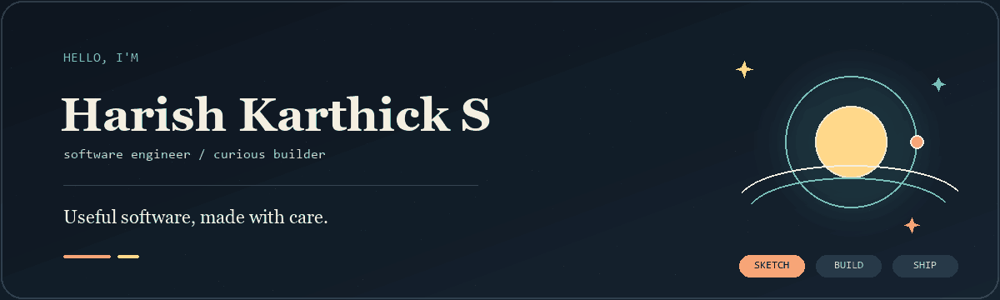

  

# Harish Karthick

**Vol. II · Autumn 2026 · Chennai**

Software, as case studies. I build products that already have a paper analogue — a GST form, a household ledger, a kitchen calendar, an exam sheet, a night-time note, a NOC screen — and refuse to dress them as one SaaS.

The long issue is the [editorial site](https://harishkarthick.vercel.app). This profile is the shop window: a few pieces of work, live where the work is public.

---

## This issue

**I. [PaperPilot](https://github.com/HarishKarthickS/PaperPilot)** · [live](https://veda-ai-assignment-web-sepia.vercel.app)  
*Exam paper.* Teacher-facing assessments: study material in, validated question papers and answer keys out. Grayscale workspace, orange actions, document view. Next.js, Express, contracts, BullMQ.

**II. [Plately](https://github.com/HarishKarthickS/Plately)** · [live](https://mealplanners.vercel.app)  
*Family kitchen.* A household meal calendar and shared grocery list — recipe-card planning, not a productivity sidebar. Next.js, Firebase, installable PWA.

**III. [Qubic Risk Radar](https://github.com/HarishKarthickS/Qubic-Risk-Radar)** · [live](https://qubic-risk-radar.vercel.app)  
*Ops console.* FastAPI rules over Qubic network events; incidents and alerts to Discord, Telegram, or email. Terminal density. Working MVP, not billed SaaS.

**IV. [SmartPrep.AI](https://github.com/HarishKarthickS/SmartPrep.AI)** · [live](https://smart-prep-ai-eight.vercel.app)  
*Study desk.* Local-first notes, chat, and a small library board in the browser. You bring an OpenRouter key; there is no hosted model subscription.

**V. [LuminaLib](https://github.com/HarishKarthickS/LuminaLib)**  
*Neighborhood library.* Catalog, members, issuances, overdue list, and a simple ₹/day fine — a small Chennai circulation desk. Express, Prisma, PostgreSQL. Run locally with Docker; no public demo.

**VI. [Sugar Spike Predictor](https://github.com/HarishKarthickS/sugar-spike-predictor)** · [live](https://sugar-spike-predictor-92g4.onrender.com/)  
*Clinical chart.* Population-specific models (diabetic vs non-diabetic) estimate post-meal glucose from health metrics and meal nutrition. Flask + XGBoost. Research and education only — not medical advice.

---

## Private flagships

These are part of the same issue on the [site](https://harishkarthick.vercel.app). Repositories are private; there is no public demo to click.

- **GST** — Multi-tenant Indian GST platform: forms, GSTIN, rupee figures, filings. FastAPI, Postgres, Redis, jobs, search, Razorpay.
- **Ledgerly** — Private household account book. Dexie first, Firestore when online. Ruled paper, not a fintech dashboard.
- **Undercurrent** — Closed, encrypted parent–child product: a tactile trail for the child, a dim evening summary for the parent. Enrollment stays closed.

The rest of the account is learning, overlap, or freeze. That is an editorial choice.

---

TypeScript · Python · Next.js · FastAPI · Postgres · Firebase · Docker

[Site](https://harishkarthick.vercel.app) · [LinkedIn](https://www.linkedin.com/in/harish-karthick-s) · [Email](mailto:harishskarthick.s@gmail.com)
